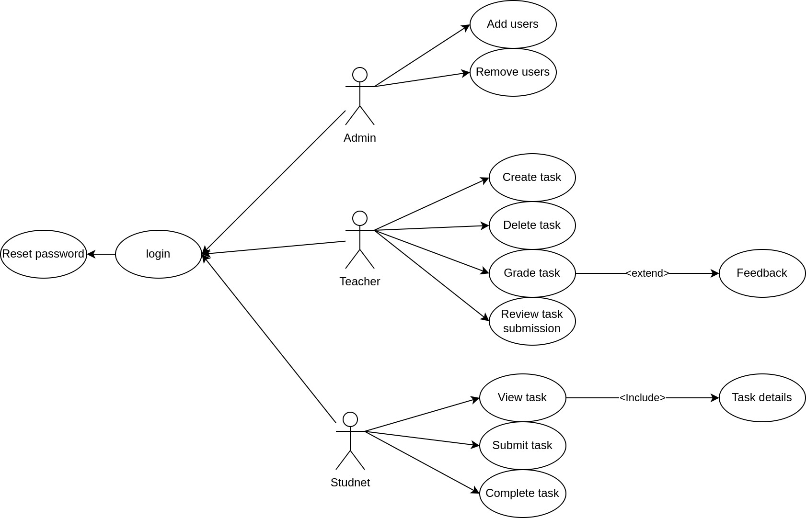
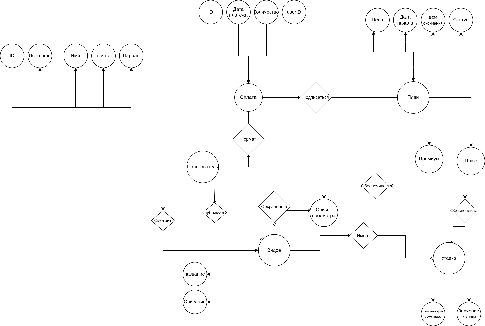
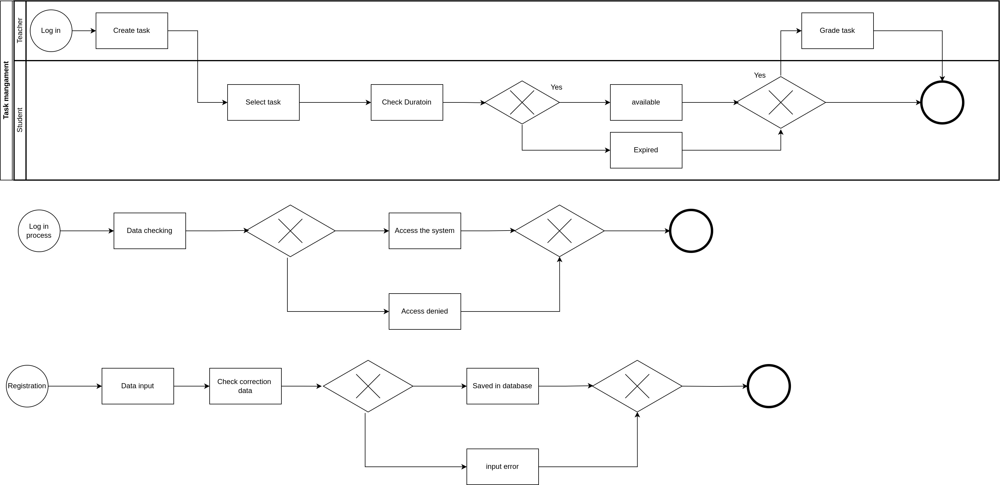

# Проект: "Academo"

## Описание проекта
"Academo" — это система управления заданиями и оценками для студентов и преподавателей. Проект позволяет преподавателям создавать и оценивать задания, а студентам — просматривать, выполнять и отправлять их на проверку.

## Предметная область
Данный проект ориентирован на образовательные учреждения, предоставляя удобный инструмент для контроля учебного процесса. Система улучшает взаимодействие между преподавателями и студентами, обеспечивая прозрачность оценивания и удобный доступ к учебным заданиям.

## Анализ аналогичных решений
| Критерий        | Существующие решения | Наше решение |
|----------------|---------------------|-------------|
| Гибкость системы | ❌ Средняя | ✅ Высокая |
| Интерфейс | ❌ Устаревший | ✅ Современный, адаптивный |
| Простота использования | ❌ Средняя | ✅ Высокая |
| Поддержка мобильных устройств | ❌ Ограниченная | ✅ Полная |
| Интеграция с LMS | ❌ Частичная | ✅ Полная |

## Целесообразность и актуальность
Проект актуален в современных реалиях дистанционного и смешанного обучения. Он предоставляет удобную платформу для взаимодействия студентов и преподавателей, упрощает процесс управления заданиями и повышает прозрачность системы оценивания.

## Акторы системы
- **Администратор** – управляет пользователями системы.
- **Преподаватель** – создаёт и оценивает задания.
- **Студент** – выполняет задания и отправляет их на проверку.

## Диаграмма вариантов использования

## ER-диаграмма сущностей

## Диаграмма компонентов

## Диаграммы классов

## Пользовательские сценарии
### 1. Создание задания преподавателем
1. Преподаватель входит в систему.
2. Выбирает опцию "Создать задание".
3. Вводит название, описание и дедлайн.
4. Сохраняет задание.

### 2. Выполнение задания студентом
1. Студент входит в систему.
2. Выбирает задание из списка.
3. Выполняет задание и отправляет его.
4. Получает уведомление о статусе проверки.

### 3. Оценивание задания преподавателем
1. Преподаватель получает уведомление о новом отправленном задании.
2. Просматривает его.
3. Оставляет оценку и комментарий.
4. Студент получает уведомление о результате.

## Формализация бизнес-процессов
